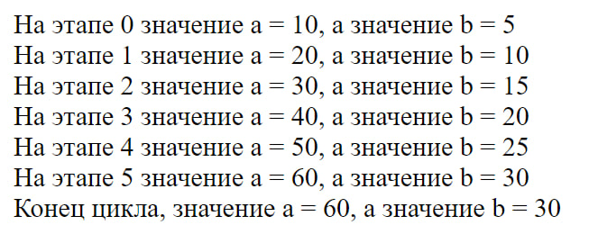
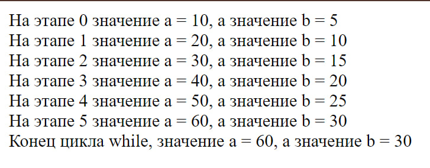
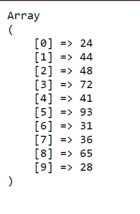
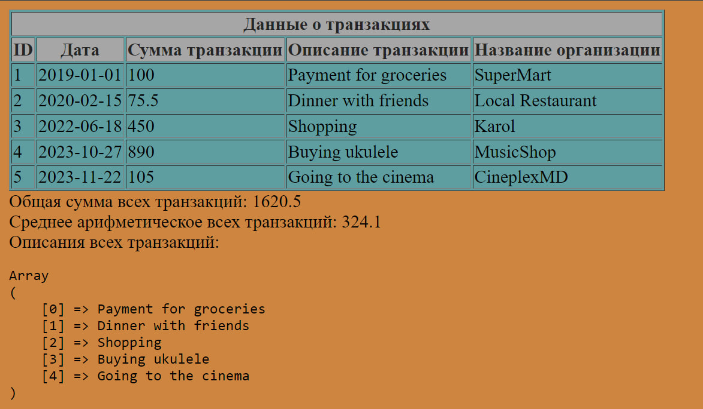

# Лабораторная работа №3

# 1.1. Задание №1 Цикл For
1. Создайте файл, содержащий соответствующий скрипт.
2. Внимательно проанализируйте синтаксис “FOR”.
3. Поменяйте скрипт так чтобы, выводились дополнительно, и все промежуточные значения для a и b.
## Скрипт
```php
<?php
$a = 0;
$b = 0;
for ($i = 0; $i <= 5; $i++) {
 $a += 10;
 $b += 5;
 echo " На этапе ". $i ." значение a = " . $a . ", а значение b = " . $b."<br/ >";
}
echo "\n Конец цикла,  значение a = " . $a . ", а значение b = " . $b;
```
>##  Комментарий:
> Надо было всего лишь добавить соответствующее сообщение внутри цикла `for`.

### Screenshot
 

# 1.2. Задание №2 Цикл while
1. Напишите код задания №1 с помощью цикла while
## Скрипт
```php
<?php
$a = 0;
$b = 0;
$i = 0;
while ($i <= 5) {
 $a += 10;
 $b += 5;
 echo " На этапе ". $i ." значение a = " . $a . ", а значение b = " . $b."<br/ >";
 $i++;
}
echo "\n Конец цикла while,  значение a = " . $a . ", а значение b = " . $b;

```
>##  Комментарий:
>В данном примере, использование цикла `while` вместо `for` приводит к тому, что управление циклом осуществляется с использованием счетчика `$i`, который увеличивается вручную внутри тела цикла. В то время как при использовании цикла for счетчик и его инкрементация управляются непосредственно в заголовке цикла.
### Screenshot
 

# 1.3. Задание №3 Определение массива
1. Определение пустой массив `$arr`.
2. Напишите программу, которая будет генерировать массив случайных чисел 
от 1 до 100 с помощью цикла `for` или `while`. 
3. Выведите полученный массив на экран.
## Скрипт
```php
<?php
$arr = [];

for ($i = 0; $i < 10; $i++) {
    $arr[$i] = rand(0, 100);
}
echo '<pre>';
print_r($arr); 
echo '</pre>';

```
>##  Комментарий:
>Создается пустой массив `$arr` и затем использует цикл `for` для заполнения его случайными числами от 0 до 100. Используется функция `rand(0, 100)`, чтобы генерировать случайные числа в диапазоне от 0 до 100.Для вывода содержимого массива используется функция `print_r()`, обернутая в тег `<pre>`, чтобы сохранить форматирование и улучшить читаемость вывода на экране.
### Screenshot
 

# 1.4. Задание №4 Использование массивов и функций
1. Определите данный `.php` файл
2. Выведите на экран данные о транзакциях
3. Добавьте данные еще для 2-3 транзакций ассоциативный в массив
4. Определение 3 пользовательские функции и выведите их значение на экран
4.1. Функция `calculateTotalAmount()` рассчитывает общую сумму всех транзакций.  
4.2. Функция `calculateAverage()` рассчитывает среднее арифметическое всех транзакций  
4.3. Функция `mapTransactionDescriptions()` возвращает новый массив, содержащий только описания транзакций.
Примечание: для удобства можете использовать функции `array_map()`, `array_reduce()`.

  __Дополнительное задание__ (Данное задание не является оцениваемым, а 
помогает вам более подробно погрузиться в изучение PHP). 
1. Создайте класс `Transaction` с полями, указанными выше
2. Создайте в классе конструктор по умолчанию
3. Вместо массива в пункте 1 определите массив из объектов класса
## Скрипт
>Код большой и не в одном файле, поэтому посмотреть его можно отдельно в прикреплённом файле `fourth.php`.

>##  Комментарий:
> Выводится таблица с данными о всех транзакциях, включая новые транзакции, добавленные в массив. Каждая строка таблицы представляет одну транзакцию, а каждый столбец представляет атрибуты этой транзакции.   
Так же выводятся результаты работы каждой из пользовательских функций.
> **Дополнительное задание**  
>Создаётся класс `Transaction`, который представляет транзакцию и содержит пять свойств. В классе также определен конструктор, который инициализирует эти свойства при создании объекта.
>
>Затем вместо массива `$transactions` определен массив объектов класса `Transaction`, где каждый объект представляет одну транзакцию.
>
>Функции `calculateTotalAmount`, `calculateAverage` и `mapTransactionDescriptions` остаются теми же, но теперь они работают с объектами класса Transaction.
>
>Далее выводится таблица с данными о транзакциях, которые теперь извлекаются из объектов класса `Transaction`. Результаты работы функций также выводятся на экран.


### Screenshot
 


# 1.5. Задание №5 Работа с файловой системой
1. Создайте директорию `"image"`, в которой сохраните не менее 20-30 изображений с расширением `.jpg`. Затем создайте файл `.php`, в котором определите веб-страницу с хедером, меню, контентом и футером. 

>##  Комментарий:
>Данный PHP код сканирует директорию `image/` и получает список файлов, затем использует полученные файлы для создания галереи изображений на веб-странице.  
>
>А если подробнее, то в скрипте:
>1. Определяется переменная `$dir`, содержащая путь к директории с изображениями.
>2. Используется функция `scandir()` для сканирования содержимого директории, указанной в переменной `$dir`, и сохранения списка файлов в массиве `$files`.
>3. Проверяется, было ли сканирование успешным (если `$files === false`, то возвращает управление).
>4. Выводится HTML код, который содержит теги ``, представляющие каждое изображение в директории.
>5. Использует цикл `for`, чтобы перебрать каждый файл в массиве `$files`. Если файл не является специальными директориями `"."` и `".."`, то формирует путь к изображению и вставляет его в тег `` с атрибутом `src`.
### Screenshots
 
 
 

